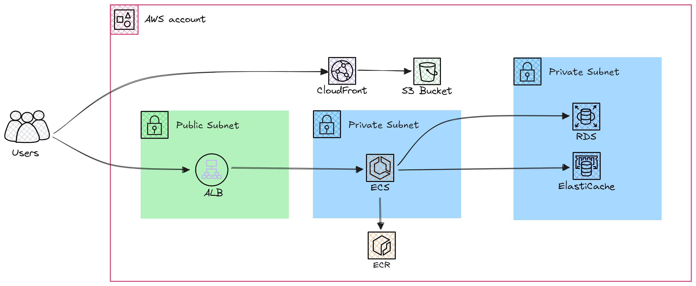

# Cloudfront-ECS-RDS-Elasticache-Pipeline
The pipeline deploys ECS services with prepared backend containers, and static frontend stored in the s3 bucket behind the Cloudfront cache. Also RDS and Elasticache databases. For deploy automation Terraform and GitHub actions is used. All services are connected using Security Groups with least priveleges, and placed into custom VPC. Docker containers are already prepared and stored in the private ECR. The applications code is stored in https://github.com/vladskvortsov/mind-project2-2 although as a CI workflow.


## Technologies Used:

#### * _AWS Services_
#### * _GitHub Actions_
#### * _Terraform_


## Prerequisites

- AWS Account
- GitHub Account

Resources diagram:



## AWS Infrastructure description

* Amazon Elastic Container Service (ECS):

Runs backend applications packed in docker containers.

* Amazon Relational Database Service (RDS):

Provides a managed database for backend operations.

* Amazon Elasticache:

Caching service (on Redis engine) for performance optimization.

* Amazon Elastic Container Registry (ECR):

Stores Docker images for the deployment.

* Application Load Balancer (ALB):

Balances the traffic for services.

* Cloudfront

Caching service for low latency connection around the world.

## Deploying the project

### Step 1: Fork and Clone
Fork the repository to your GitHub account. Clone the repository to your local machine for configuration or modifications.

### Step 2: Set up Secrets
Go to Settings > Secrets and Variables > Actions in your GitHub repository.
Add the secrets for AWS:

```sh
AWS_ACCESS_KEY_ID: IAM access key for AWS API operations.
AWS_SECRET_ACCESS_KEY: Secret key paired with the access key.
AWS_REGION: The AWS region where resources will be created (e.g., us-east-1).
```

### Step 3: Deploy AWS Resources
Trigger the _deploy-project_ workflow to deploy the whole infrastructure.

### Step 4: Confirm Resources Status
Validate that the AWS resources are alive:

Check ECS Cluster Tasks for running and inspect logs.
Verify RDS and ElastiCache instances are available using the AWS Management Console or CLI.

> Note: It might take up to `5 minutes` for all the services to start.

### Step 5: Access the frontend webpage using Cloudfront DNS name
Copy the Cloudfront DNS name from your GitHub Action logs and access the frontend page. 

> Note: Use `http://` connection for this project.

## Removing Resources: 

Use the `destroy-resources` workflow to remove resources.

## Database environmental variables:
Variables for backend used by phyton code, if you wanna use your own containers you should provide yours in the `terraform.tfvars`.

```sh
DB_NAME
DB_USER
DB_PASSWORD 
DB_PORT 
REDIS_PORT 
```

## Key Notes:

> Resources Costs:
 Ensure you understand AWS pricing to manage project costs effectively. `ECS configuration for this project isn't free!` 

> Security:
 Use least privilege access for AWS credentials. `Don't paste AWS credentials anywhere excluding GitHub Secrets`

> Debugging:
 You can monitor the infrastructure deploying in GitHub Action logs, and find out errors if they present.

> Documentation:
 Don't forget to update the repository’s `README.md` to reflect current workflows and configurations.